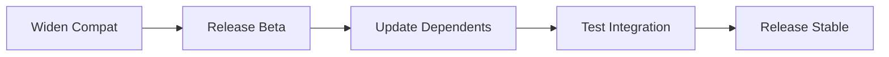

# Local Registry Guide: ct-registry

This guide explains how to set up and use the `ct-registry` local Julia registry for the control-toolbox ecosystem.

## Table of Contents

- [What is ct-registry?](#what-is-ct-registry)
- [Why Use a Local Registry?](#why-use-a-local-registry)
- [Setup for Developers](#setup-for-developers)
- [Registering Packages](#registering-packages)
- [Beta Strategy for Breaking Changes](#beta-strategy-for-breaking-changes)
- [GitHub Actions Integration](#github-actions-integration)
- [Troubleshooting](#troubleshooting)

## What is ct-registry?

`ct-registry` is a **private local registry** for the control-toolbox ecosystem, hosted at [github.com/control-toolbox/ct-registry](https://github.com/control-toolbox/ct-registry).

> [!NOTE]
> Most control-toolbox packages are now available in the official [Julia General Registry](https://github.com/JuliaRegistries/General). The local registry is primarily used for:
> - **Beta versions** during breaking change migrations
> - **Pre-release testing** before General registry publication
> - **Private packages** not yet ready for public release

## Why Use a Local Registry?

### The Beta Strategy

The local registry enables the **beta version strategy** for managing breaking changes in the ecosystem. This is critical for solving the [diamond dependency problem](diamond-dependency.md).

**Key use case**: When `CTBase` releases a breaking change (v1 → v2), we need to:

1. **Test integration** with updated dependent packages (CTDirect, CTModels, etc.)
2. **Avoid breaking** existing users who depend on stable versions
3. **Enable gradual migration** across the ecosystem

**Solution**: Release beta versions (`v2.0.0-beta`) in `ct-registry` that:

- Are **invisible to regular users** (Julia resolver prefers stable versions)
- Allow **developers to test** integration with new versions
- Enable **parallel development** without blocking the ecosystem

See [Diamond Dependency Problem](diamond-dependency.md) for detailed mechanics.

### Private Development

The registry also supports:

- **Work-in-progress packages** before public release
- **Experimental features** in pre-release versions
- **Internal tools** specific to control-toolbox development

## Setup for Developers

### Prerequisites

- Julia 1.6 or later
- Git (≥1.8.5) installed and in PATH
- SSH access to GitHub (for private registry)

Verify git is available:

```julia
julia> run(`git --version`)
```

### 1. Configure SSH Access

The registry is private and requires SSH authentication.

#### Generate SSH Key (if needed)

```bash
ssh-keygen -t ed25519 -C "your.email@example.com"
```

#### Add SSH Key to GitHub

1. Copy your public key:
   ```bash
   cat ~/.ssh/id_ed25519.pub
   ```

2. Add to GitHub: [github.com/settings/keys](https://github.com/settings/keys)

3. Test connection:
   ```bash
   ssh -T git@github.com
   ```

### 2. Add the Registry

From Julia REPL:

```julia
using Pkg
pkg> registry add git@github.com:control-toolbox/ct-registry.git
```

Or using HTTPS (requires GitHub token):

```julia
pkg> registry add https://github.com/control-toolbox/ct-registry.git
```

**Verify installation**:

```julia
pkg> registry status
```

You should see `ct-registry` listed alongside the General registry.

### 3. Install LocalRegistry.jl

For package maintainers who need to register new versions:

```julia
using Pkg
Pkg.add("LocalRegistry")
```

## Registering Packages

### Register a New Package

From the package directory:

```julia
using LocalRegistry
using MyPackage  # Load your package

# Register in ct-registry
register(MyPackage, 
   registry = "ct-registry",
   repo = "git@github.com:control-toolbox/MyPackage.jl.git")
```

**Requirements**:
- Package must have a `Project.toml` with name and version
- Package must be in a git repository
- Working directory must be the package root OR package must be activated

### Register a New Version

1. **Update version** in `Project.toml`:
   ```toml
   version = "1.2.0"
   ```

2. **Commit changes**:
   ```bash
   git add Project.toml
   git commit -m "Bump version to 1.2.0"
   ```

3. **Register**:
   ```julia
   using LocalRegistry
   using MyPackage
   register(MyPackage, 
      registry = "ct-registry",
      repo = "git@github.com:control-toolbox/MyPackage.jl.git")
   ```

4. **Create GitHub release** with tag `v1.2.0`
    ```shell
    # Checkout the branch
    git checkout my-branch

    # Create a lightweight tag
    git tag v1.2.0

    # Or create an annotated tag (preferred for releases)
    git tag -a v1.2.0 -m "Release version 1.2.0"

    # Push the tag to remote
    git push origin v1.2.0
    ```

### Register a Beta Version

For breaking changes, use pre-release versions:

```toml
# Project.toml
version = "2.0.0-beta.1"
```

Then register normally:

```julia
using LocalRegistry
using MyPackage
register(MyPackage, 
   registry = "ct-registry",
   repo = "git@github.com:control-toolbox/MyPackage.jl.git")
```

**Beta naming conventions**:
- `2.0.0-beta.1`, `2.0.0-beta.2`, ... for beta releases
- `2.0.0-rc.1`, `2.0.0-rc.2`, ... for release candidates
- `2.0.0` for final stable release

## Beta Strategy for Breaking Changes

### Overview

When making breaking changes to a foundational package like `CTBase`, follow this workflow:



### Step-by-Step Workflow

#### Phase 1: Preventive Widening

**Before** releasing the breaking change, widen compat in **all dependent packages**:

```toml
# In CTDirect, CTModels, CTParser, OptimalControl, etc.
[compat]
CTBase = "1, 2.0.0-"  # Accept v1 AND v2 pre-releases
```

**Why?** This allows the resolver to find v2 betas when needed, while still preferring v1 stable for regular users.

#### Phase 2: Release Beta in ct-registry

```bash
cd CTBase
# Make breaking changes
# Update version to 2.0.0-beta.1 in Project.toml
```

```julia
using LocalRegistry
register()
```

**Effect**: 
- Regular users still get `CTBase v1` (stable preferred)
- Developers can test with `CTBase v2-beta.1` when needed

#### Phase 3: Update Dependent Packages

```bash
cd CTDirect
# Adapt code to CTBase v2 API
```

```toml
# CTDirect Project.toml
[compat]
CTBase = "2.0.0-"  # Require v2 (beta or stable)
```

Register the updated package:

```julia
using LocalRegistry
register()  # Creates CTDirect v2.0.0-beta.1
```

#### Phase 4: Test Integration

```julia
using Pkg

# Test that OptimalControl works with new CTDirect
Pkg.develop(path="path/to/OptimalControl")
Pkg.test("OptimalControl")

# Resolver will choose:
# - CTBase v2-beta.1 (only option satisfying all constraints)
# - CTDirect v2-beta.1 (requires CTBase v2)
# - OptimalControl v1 (accepts CTBase v1 or v2)
```

#### Phase 5: Release Stable

Once all dependent packages are updated and tested:

```bash
cd CTBase
# Update version to 2.0.0 in Project.toml
```

```julia
using LocalRegistry
register()
```

**Then** register in the General registry:

```julia
# In GitHub issue, PR, or commit
@JuliaRegistrator register()
```

### Why This Works

The beta strategy leverages Julia's resolver mechanics:

1. **Pre-releases are invisible** unless explicitly allowed in compat
2. **Widening creates resolution paths** for testing
3. **Stable preference protects users** from accidental upgrades
4. **Gradual migration** allows independent package updates

See [Diamond Dependency Problem](diamond-dependency.md) for detailed explanation.

## GitHub Actions Integration

### Overview

The `ct-registry` is integrated into CI/CD workflows via [CTActions](https://github.com/control-toolbox/CTActions), which provides reusable GitHub Actions workflows.

### Breakage Testing Workflow

The [`breakage.yml`](https://github.com/control-toolbox/CTActions/blob/main/.github/workflows/breakage.yml) workflow tests if changes in a package break its dependents.

**Example**: Testing if `CTBase` changes break `CTDirect`:

```yaml
# In CTBase/.github/workflows/ci.yml
name: CI

on: [push, pull_request]

jobs:
  # ... other jobs ...

  breakage:
    uses: control-toolbox/CTActions/.github/workflows/breakage.yml@main
    with:
      pkgname: CTDirect
      pkgpath: control-toolbox
      pkgversion: latest
      use_registry: true  # Enable ct-registry access
    secrets:
      SSH_KEY: ${{ secrets.SSH_KEY }}
```

### Setting Up SSH Access for Actions

#### 1. Generate Deploy Key

On your local machine:

```bash
ssh-keygen -t ed25519 -C "github-actions-ct-registry" -f /tmp/ct-registry-deploy-key -N ""
```

#### 2. Add Deploy Key to ct-registry

1. Go to [github.com/control-toolbox/ct-registry/settings/keys](https://github.com/control-toolbox/ct-registry/settings/keys)
2. Click **"Add deploy key"**
3. **Title**: `GitHub Actions - Breakage Workflow`
4. **Key**: Paste the **public key** from `/tmp/ct-registry-deploy-key.pub`
5. **Allow write access**: ❌ Leave unchecked (read-only)
6. Click **"Add key"**

#### 3. Add Organization Secret

1. Go to [github.com/organizations/control-toolbox/settings/secrets/actions](https://github.com/organizations/control-toolbox/settings/secrets/actions)
2. Click **"New organization secret"**
3. **Name**: `SSH_KEY`
4. **Value**: Paste the **private key** from `/tmp/ct-registry-deploy-key`
5. **Repository access**: Select repositories that need access (or "All repositories")
6. Click **"Add secret"**

#### 4. Clean Up

```bash
rm /tmp/ct-registry-deploy-key /tmp/ct-registry-deploy-key.pub
```

### Workflow Parameters

The `breakage.yml` workflow accepts:

| Parameter | Required | Default | Description |
|-----------|----------|---------|-------------|
| `pkgname` | ✅ | - | Package name to test (e.g., `CTDirect`) |
| `pkgpath` | ✅ | - | GitHub organization/user (e.g., `control-toolbox`) |
| `pkgversion` | ✅ | - | Version to test: `latest`, `stable`, or specific tag |
| `pkgbreak` | ❌ | `test` | What to run: `test` or `doc` |
| `use_registry` | ❌ | `true` | Whether to add ct-registry |

**Secrets**:
- `SSH_KEY`: SSH private key for ct-registry access (optional if `use_registry: false`)

### Example: Testing Beta Versions

```yaml
# Test if CTBase v2-beta breaks CTDirect latest
jobs:
  breakage-beta:
    uses: control-toolbox/CTActions/.github/workflows/breakage.yml@main
    with:
      pkgname: CTDirect
      pkgpath: control-toolbox
      pkgversion: latest
      use_registry: true
    secrets:
      SSH_KEY: ${{ secrets.SSH_KEY }}
```

This will:
1. Clone `CTDirect` from GitHub
2. Add `ct-registry` using the SSH key
3. Install `CTBase` (resolver will choose v2-beta if required by compat)
4. Run `CTDirect` tests
5. Report success/failure

## Troubleshooting

### Cannot Find Packages from General Registry

If you can't find packages from the General registry after adding `ct-registry`:

```julia
pkg> registry status
pkg> registry update
```

If problems persist, remove and re-add registries:

```julia
pkg> registry rm General
pkg> registry add  # Re-adds General
pkg> registry add git@github.com:control-toolbox/ct-registry.git
```

### SSH Authentication Failed

**Error**: `Permission denied (publickey)`

**Solutions**:

1. **Verify SSH key is added to GitHub**:
   ```bash
   ssh -T git@github.com
   ```

2. **Use ssh-agent**:
   ```bash
   eval "$(ssh-agent -s)"
   ssh-add ~/.ssh/id_ed25519
   ```

3. **Check SSH config** (`~/.ssh/config`):
   ```
   Host github.com
     HostName github.com
     User git
     IdentityFile ~/.ssh/id_ed25519
   ```

### Registry Not Found

**Error**: `Registry ct-registry not found`

**Solution**: The registry might not be properly added. Re-add it:

```julia
pkg> registry add git@github.com:control-toolbox/ct-registry.git
```

### Package Not Found in Registry

**Error**: `Package MyPackage not found in registry`

**Possible causes**:

1. **Package not registered yet**: Register it using `LocalRegistry.register()`
2. **Registry not updated**: Run `pkg> registry update`
3. **Wrong registry**: Check that you're looking in `ct-registry`, not General

### Beta Version Not Resolved

**Problem**: Julia resolver doesn't pick up beta versions

**Solution**: Check compat entries allow pre-releases:

```toml
# This IGNORES betas
[compat]
CTBase = "1"

# This ALLOWS betas
[compat]
CTBase = "1, 2.0.0-"
```

See [Diamond Dependency Problem](diamond-dependency.md#pre-release-behavior) for details.

### GitHub Actions: Registry Access Failed

**Error in CI**: `Could not read from remote repository`

**Solutions**:

1. **Verify SSH_KEY secret exists**:
   - Check organization secrets: [github.com/organizations/control-toolbox/settings/secrets/actions](https://github.com/organizations/control-toolbox/settings/secrets/actions)
   - Ensure repository has access to the secret

2. **Verify Deploy Key in ct-registry**:
   - Check deploy keys: [github.com/control-toolbox/ct-registry/settings/keys](https://github.com/control-toolbox/ct-registry/settings/keys)
   - Ensure the public key matches the private key in `SSH_KEY` secret

3. **Check workflow configuration**:
   ```yaml
   secrets:
     SSH_KEY: ${{ secrets.SSH_KEY }}  # Must pass secret explicitly
   ```

## References

- [LocalRegistry.jl Documentation](https://github.com/GunnarFarneback/LocalRegistry.jl)
- [Diamond Dependency Problem](diamond-dependency.md)
- [Breaking Change Rules](breaking-change-rules.md)
- [CTActions Repository](https://github.com/control-toolbox/CTActions)
- [Julia Pkg.jl Documentation](https://pkgdocs.julialang.org/)
- [Semantic Versioning](https://semver.org)

## Summary

The `ct-registry` local registry enables:

✅ **Beta version strategy** for safe breaking changes  
✅ **Integration testing** before General registry release  
✅ **Private development** of experimental features  
✅ **CI/CD integration** via GitHub Actions  
✅ **Gradual migration** across the ecosystem  

For breaking change workflows, see:
- [Case Study: CTDirect Breaking Change](case-study-ctdirect-breaking.md)
- [Case Study: CTModels Breaking Change](case-study-ctmodels-breaking.md)
- [Case Study: CTBase Cascading Change](case-study-ctbase-cascading.md)
